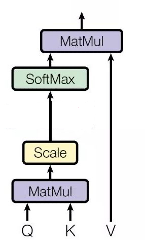

模型都未进行调参，未能使模型的准确率达到最高
# 项目名称：
使用 Bi-LSTM-Attention 模型来对进行实体识别

# 项目环境：
pytorch、python   
相关库安装
```
pip install -r requirement.txt
```

# 项目目录：
```
Bi-LSTM-Attention  
    |-- data                 数据集   
    |-- img                  存放模型相关图片            
    |-- model                保存的模型               
    |-- config.py            配置文件                              
    |-- main.py              主函数                      
    |-- model.py             模型文件                     
    |-- predict.py           预测文件                         
    |-- requirement.txt      需要的安装包
    |-- utils.py             数据处理文件
```

# 项目介绍
使用了Bi-LSTM-Attention 模型来判断文本中实体与实体的关系，其中特征使用词向量+位置向量。

# 项目数据集
[数据集](https://github.com/buppt//raw/master/data/people-relation/train.txt)

朱时茂	陈佩斯	合作	《水与火的缠绵》《低头不见抬头见》《天剑群侠》小品陈佩斯与朱时茂1984年《吃面条》合作者：陈佩斯聽1985年《拍电影》合
女	卢润森	unknown	卢恬儿是现任香港南华体育会主席卢润森的千金，身为南华会太子女的卢恬儿是名门之后，身家丰厚，她长相
傅家俊	丁俊晖	好友	改写23年历史2010年10月29日，傅家俊1-5输给丁俊晖，这是联盟杯历史上首次出现了中国德比，丁俊晖傅家俊携手改写了

# 模型介绍
Bi-LSTM模型：

关于LSTM可以看这篇文章：[08-LSTM 实体识别](../08-LSTM 实体识别/README.md)

Bi-LSTM(Bi-directional LSTM)，就可以更好的捕捉双向的语义依赖，对于更细粒的分类可以很好学到（如：表示程度的词）。   

由前向的 LSTM 和 后向的 LSTM 结合成 Bi-LSTM   

决定参数：```bidirectional: If True, becomes a bidirectional LSTM. Default: False```

Attention模型：



推荐一个讲解Attention的文章：
[Attention 机制超详细讲解(附代码)](https://zhuanlan.zhihu.com/p/149490072)

# 函数介绍
torch.bmm
用于执行批矩阵乘法（Batch matrix multiplication）。bmm代表的是批次的矩阵乘法（Batched matrix multiplication）。
该函数用于计算两个3D张量之间的矩阵乘法，其中第一个张量的维度为（B×n×m），第二个张量的维度为（B×m×p），结果张量的维度为（B×n×p）。
其中，B表示批次中的样本数量，n表示第一个张量的行数，m表示第一个张量的列数（同时也是第二个张量的行数），p表示第二个张量的列数。
```python
import torch

# 示例
tensor1 = torch.tensor([[[1, 2, 3],
                         [4, 5, 6]]])  # shape: (1, 2, 3)
tensor2 = torch.tensor([[[7, 8],
                         [9, 10],
                         [11, 12]]])  # shape: (1, 3, 2)

result = torch.bmm(tensor1, tensor2)  # shape: (1, 2, 2)

print(result)
```

tensor1的形状为(1, 2, 3)，tensor2的形状为(1, 3, 2)。
通过torch.bmm函数进行批矩阵乘法，得到的结果result的形状为(1, 2, 2)。
其中，1表示批次中的样本数量（batch size），2表示result矩阵的行数和列数。

# 数据划分
这里就只划分了训练姐和测试集
```
    # 计算80%和20%的切分点
    num_rate = int(0.7 * len(all_text))
    if self.mode == "Train":
        temp_data = all_text[:num_rate]
        div_num = len(temp_data) - len(temp_data) // hp.batch_size * 2
        if div_num != 0:
            need_num = hp.batch_size - div_num
            all_data = all_text[:num_rate + need_num]
        else:
            all_data = temp_data
    else:
        temp_data = all_text[num_rate:]
        div_num = len(temp_data) - len(temp_data) // hp.batch_size * 2
        if div_num != 0:
            need_num = hp.batch_size - div_num
            all_data = all_text[num_rate - need_num:]
        else:
            all_data = temp_data
```

按照6:2:2进行数据划分，得到训练集，测试集，验证集
```
    # 计算60%、20%和20%的切分点
    num_rate = int(0.6 * len(all_text))
    num_rate2 = int(0.8 * len(all_text))
    if self.mode == "Train":
        temp_data = all_text[:num_rate]
        div_num = len(temp_data) - len(temp_data) // hp.batch_size * 2
        if div_num != 0:
            need_num = hp.batch_size - div_num
            all_data = all_text[:num_rate + need_num]
        else:
            all_data = temp_data
    elif self.mode == "Val":
        temp_data = all_text[num_rate:num_rate2]
        div_num = len(temp_data) - len(temp_data) // hp.batch_size * 2
        if div_num != 0:
            need_num = hp.batch_size - div_num
            all_data = all_text[num_rate - need_num:num_rate2]
        else:
            all_data = temp_data
    else:
        temp_data = all_text[num_rate2:]
        div_num = len(temp_data) - len(temp_data) // hp.batch_size * 2
        if div_num != 0:
            need_num = hp.batch_size - div_num
            all_data = all_text[num_rate2 - need_num:]
        else:
            all_data = temp_data
```


# 模型训练
`python main.py`

# 模型预测
`python predict.py`


# 微信交流群
我们有一个微信交流群，大家如果有需要，可以加入我们，一起进行学习。关注公众号后会有一个私人微信，添加微信，备注进群，就可以拉你进群，进行学习。

   

